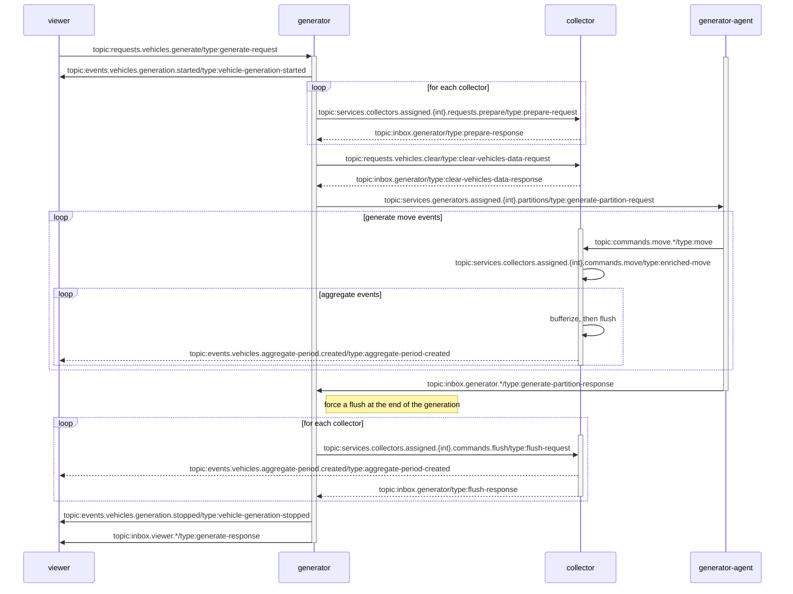
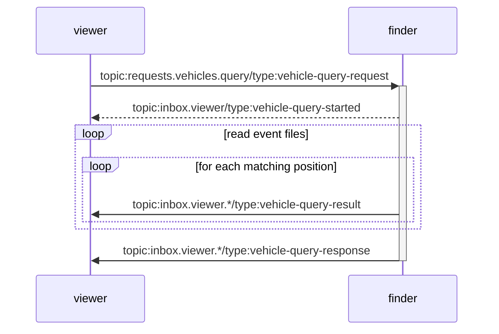
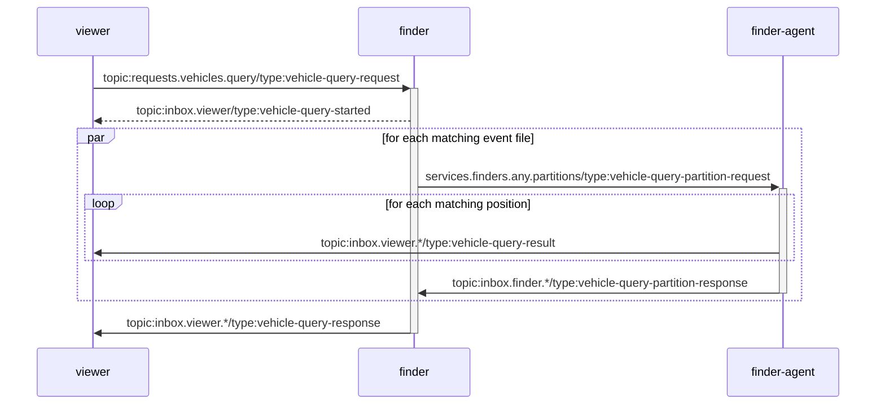

# Purpose

This is a sample project for exploring different ways of persisting Geospatial events for long term storage.

This is also an excuse to test various technologies to handle a massive amount of data.
This includes different programming languages, as well as cloud services.

# Functional requirements

- An organization would manage a fleet of vehicles that would report their current GPS position every 5 seconds.
- The vehicles would remain in the area of a specific city and would typically be assigned to a district of the city.
- The data should be archived for 7 years
- The data should be queryable in order to find which cars where moving in a specific period, within a specific area of the city.

# Estimates

Execute the `estimate.py` script to compute the estimates in the [event-estimator](./event-estimator/) folder.

# Architecture

## Messages

Note that the following sections are generated automatically from the http://localhost:3000/settings/messages page, section "Documentation",
using the "Copy as Markdown" button, at the bottom of the page.

### Subscriptions

|Path   |Type          |Services|
|-------|--------------|--------|
|commands/move|queue|collector|
|commands/move|topic|viewer|
|events/vehicles/{type}/{subType}|topic|viewer|
|inbox/collector/{id}|queue|collector|
|inbox/finder/{id}|queue|finder|
|inbox/generator/{id}|queue|generator|
|inbox/viewer/{id}|queue|viewer|
|messaging/control|topic|collector, finder, generator, viewer|
|messaging/control/collector|topic|collector|
|messaging/control/finder|topic|finder|
|messaging/control/generator|topic|generator|
|messaging/control/viewer|topic|viewer|
|requests/vehicles/clear|queue|collector|
|requests/vehicles/generate|queue|generator|
|requests/vehicles/query|queue|finder|
|services/collectors/assigned/{int}/...|queue|collector|
|services/finders/any/...|queue|finder|
|services/generators/assigned/{int}/...|queue|generator|
|services/generators/tracking/{int}|queue|generator|

### Message handlers

|Handler Name|Message Types|Services|Description|
|------------|-------------|--------|-----------|
|AssignedMoveCommandHandler|enriched-move|collector|Dedicated collector that will accumulate events for its assigned partition key.|
|CancelRequestHandler|cancel-request-id, cancel-request-parentId, cancel-request-type|collector, finder, generator, viewer|Finds and cancels active message handlers.|
|ClearVehiclesDataHandler|clear-vehicles-data-request|collector|Deletes all vehicle positions before running a new simulation.|
|DispatchFlushDataHandler|dispatch-flush|collector|Dispatches a flush command to the assigned collectors. (fire and forget command)|
|DispatchFlushRequestHandler|dispatch-flush-request|collector|Dispatches a flush command to the assigned collectors (request/reply)|
|FlushDataHandler|flush|collector|Forces the collector to flush its cached data. (fire and forget command)|
|FlushRequestHandler|flush-request|collector|Forces the collector to flush its cached data. (sync request/reply)|
|GenerateHandler|generate-request|generator|Coordinates the generation of the vehicle positions by partitioning the work into sub-generators|
|GeneratePartitionHandler|generate-partition-request|generator|Generates the vehicle positions for a subset of the vehicles based on the configured partition key.|
|InfoRequestHandler|info-request|collector, finder, generator, viewer|Returns information about the message types and the subscriptions|
|MessageTrackingHandler|message-tracking-ack|generator|Receives the message processing status of the collectors, to decide if we need to apply back pressure.|
|MoveCommandHandler|move|collector|Receives vehicle positions and dispatch them to dedicated collectors based on the configured partition key.|
|PingRequestHandler|ping|collector, finder, generator, viewer|Returns information about the service that participates to the system|
|PrepareCollectorHandler|prepare-request|collector|A collector should prepare to receive messages before a new generation.|
|VehicleFinderViewModel|vehicle-query-result|viewer|Receives a vehicle position matching the search criteria|
|VehicleQueryHandler|vehicle-query-request|finder|Coordinates the search of vehicle positions by partitioning the work across multiple search agents, using the configured partition key.|
|VehicleQueryPartitionHandler|vehicle-query-partition-request|finder|This is a search agent that will search vehicle positions for its assigned partitions|
|VehicleTrackingViewModel|aggregate-period-created|viewer|Receives a notification for each aggregate period created|
|VehicleTrackingViewModel|vehicle-generation-started|viewer|Receives a notification when a new generation starts|
|VehicleTrackingViewModel|vehicle-generation-stopped|viewer|Receives a notification when a active generation stops|
|VehicleViewerViewModel|vehicle-query-result|viewer|Receives a vehicle position matching the search criteria|
|VehicleViewerViewModel|vehicle-query-started|viewer|Receives a notification when a new search starts|
|VehicleViewerViewModel|vehicle-generation-started|viewer|Receives a notification when a new generation starts|
|VehicleViewerViewModel|move, enriched-move|viewer|Receives the vehicle positions|

### Message routes

|Sender|Message Type|Subject|Receiver|Subscription|
|------|------------|-------|--------|------------|
|collector|flush-response|inbox.collector|collector|inbox.collector|
|collector|clear-vehicles-data-response|inbox.generator|generator|inbox.generator|
|collector|dispatch-flush-response|inbox.generator|generator|inbox.generator|
|collector|prepare-response|inbox.generator|generator|inbox.generator|
|collector|info-response|inbox.viewer|viewer|inbox.viewer|
|collector|flush-request|services.collectors.assigned.{int}.commands.flush|collector|services.collectors.assigned.{int}.&gt;|
|collector|enriched-move|services.collectors.assigned.{int}.commands.move|collector|services.collectors.assigned.{int}.&gt;|
|collector|message-tracking-ack|services.generators.tracking.{int}|generator|services.generators.tracking.{int}|
|finder|vehicle-query-partition-response|inbox.finder|finder|inbox.finder|
|finder|info-response|inbox.viewer|viewer|inbox.viewer|
|finder|vehicle-query-partition-request|services.finders.any.partitions|finder|services.finders.any.&gt;|
|generator|dispatch-flush-request|commands.move|collector|commands.move|
|generator|generate-partition-response|inbox.generator|generator|inbox.generator|
|generator|info-response|inbox.viewer|viewer|inbox.viewer|
|generator|clear-vehicles-data-request|requests.vehicles.clear|collector|requests.vehicles.clear|
|generator|prepare-request|services.collectors.assigned.{int}.requests.prepare|collector|services.collectors.assigned.{int}.&gt;|
|generator|generate-partition-request|services.generators.assigned.{int}.partitions|generator|services.generators.assigned.{int}.&gt;|
|unknown|move|commands.move|collector|commands.move|
|viewer|info-response|inbox.viewer|viewer|inbox.viewer|
|viewer|info-request|messaging.control|collector|messaging.control|
|viewer|info-request|messaging.control|finder|messaging.control|
|viewer|info-request|messaging.control|generator|messaging.control|
|viewer|info-request|messaging.control|viewer|messaging.control|
|viewer|ping|messaging.control|collector|messaging.control|
|viewer|ping|messaging.control|finder|messaging.control|
|viewer|ping|messaging.control|generator|messaging.control|
|viewer|cancel-request-type|messaging.control.generator|generator|messaging.control.generator|
|viewer|generate-request|requests.vehicles.generate|generator|requests.vehicles.generate|
|viewer|vehicle-query-request|requests.vehicles.query|finder|requests.vehicles.query|

### Collecting move commands



### Querying move commands

#### Serialized processing



#### Parallel processing



## Local dev

### Features

- web UI for viewing realtime data or query results
- distributed services using a message broker
- durable storage of events
- distributed event generation with multiple instances for higher throughput
- multiple serialization formats (json, ProtoBuf)
- multiple data formats (parquet, csv, json, arrow)
- multiple storage providers (filesystem, S3...)
- flexible aggregation of events

    - max window capacity
    - concurrent time windows
    - multiple data partitioning strategies (geohash, vehicle id...)

- flexible search

    - serialized or parallelized
    - record limit
    - timeout
    - ttl
    - time filters (time range)
    - geoloc filters (polygons) using GeoJSON
    - data filters (vehicle type)


### Diagram


```

                            +------------+
      Event Generator-------| Event Hub  |------Event Viewer
                            | (NATS)     |
                            +------------+
                              |      |
                        +-----+      +-----+
                        |                  |
                  Event collector       Event finder
                   |    |                  |
        +----------+  writes             reads
        |               |                  |
+-------------+      +-----------------------+
| Event Store |      | Event Aggregate Store |
| (In memory) |      | (File system or S3)   |
+-------------+      +-----------------------+

```

### Technologies:

- Event Hub: [NATS](https://nats.io/)
- Event Generator: Typescript NodeJS
- Event Viewer: Nuxt server, Typescript, PixiJS
- Event Collector: Typescript NodeJS, https://pola.rs/, Parquet format, S3, geohash
- Event Store: In memory, DuckDB
- Event finder: 
    - Typescript NodeJS, geohash, turf
    - Rust, datafusion, geo, geojson, geohash, nats, actix-web

## Cloud

### Azure

Inspired by https://learn.microsoft.com/en-us/azure/stream-analytics/event-hubs-parquet-capture-tutorial

#### Diagram

```
                                           +-----> Event Viewer
                                           |         + NuxtJS
Event Generator ==> Event Hub -------------+         + PowerBI
                     + Azure Event Hubs    |
                                           +----> Event Collector -------> Event Aggregate Store <------ Event finder
                                                  + Azure Stream Analytics      + Azure Blob                 + Azure Synapse
```

#### Event aggregation

See https://learn.microsoft.com/en-us/azure/event-hubs/event-hubs-capture-overview
and https://learn.microsoft.com/en-us/azure/event-hubs/event-hubs-capture-enable-through-portal
and https://learn.microsoft.com/en-us/azure/stream-analytics/event-hubs-parquet-capture-tutorial

#### Querying

##### Create a new Azure Synapse Analytics resource

You should create a Blob storage account with the following attributes:
- Azure Blob Storage or Azure Data Lake Storage Gen 2
- Enable hierarchical namespace = true

Then you can create your new Azure Synapse Analytics resource and use the previously created Storage Account.

##### Configure the external data source 

See also the tutorial that demonstrates all the steps: https://www.youtube.com/watch?v=WMSF_ScBKDY

- Go to your Azure Synapse portal.
- Select the "Develop" section.
- click the "+" button and select "SQL script"
- name it "configure_db"
- paste the following script and execute it:

```sql
CREATE DATABASE vehicles;
GO;

USE vehicles;

-- You should generate a new password
CREATE MASTER KEY ENCRYPTION BY PASSWORD = '<REDACTED>';

CREATE DATABASE SCOPED CREDENTIAL VehicleDataCredential
WITH
    IDENTITY = 'SHARED ACCESS SIGNATURE',
    -- you should copy the SAS token configured for your Storage Account, in the "Shared access signature"
    SECRET = 'sv=2022-11-02&ss=b&srt=co&sp=rlf&se=2024-12-31T22:42:44Z&st=2024-12-15T14:42:44Z&spr=https&sig=<REDACTED>';

create external data source VehicleDataEvents with ( 
    -- you should replace morganvehicledata with the name of your Storage Account.
    location = 'wasbs://events@morganvehicledata.blob.core.windows.net',
    CREDENTIAL = VehicleDataCredential  
);

GO;
```

##### Create queries

The strategy is to use the right BULK filter in order to only select the files containing the data, based on the time range and geohash list.

###### Filter data and get stats

- Go to your Azure Synapse portal.
- Select the "Develop" section.
- click the "+" button and select "SQL script"
- name it "events_per_file"
- paste the following script and execute it:

```sql
use vehicles;

SELECT ev.filename() as filename, COUNT(*) as event_count
FROM  
    OPENROWSET(
        BULK '2024-01-01-*-*-*-*.parquet',
        DATA_SOURCE = 'VehicleDataEvents',
        FORMAT='PARQUET'
    ) AS ev
WHERE
    ev.filepath(1) in ('05', '06', '07')
    AND ev.filepath(3) in ('f257v', 'f25k6', 'f25se', 'f25ss')
    AND ev.timestamp >= '2024-01-01T05:05:00'
    AND ev.timestamp < '2024-01-01T07:05:00'
GROUP BY
  ev.filename()
ORDER BY
  1
```

###### Filter data and get events

- Go to your Azure Synapse portal.
- Select the "Develop" section.
- click the "+" button and select "SQL script"
- name it "get_events"
- paste the following script and execute it:

```sql
use vehicles;

SELECT ev.*
FROM  
    OPENROWSET(
        BULK '2024-01-01-*-*-*-*.parquet',
        DATA_SOURCE = 'VehicleDataEvents',
        FORMAT='PARQUET'
    ) AS ev
WHERE
    ev.filepath(1) in ('05', '06', '07')
    AND ev.filepath(3) in ('f257v', 'f25k6', 'f25se', 'f25ss')
    AND ev.timestamp >= '2024-01-01T05:05:00'
    AND ev.timestamp < '2024-01-01T07:05:00'
ORDER BY
  ev.timestamp
```

##### References

https://learn.microsoft.com/en-us/azure/synapse-analytics/sql/query-parquet-files
https://learn.microsoft.com/en-us/azure/synapse-analytics/sql/query-specific-files
https://learn.microsoft.com/en-us/azure/synapse-analytics/sql/tutorial-data-analyst

##### TODO

Use a service principal and/or workload identities instead of SAS tokens.

#### Technologies:

- Event Hub: [Azure Event Hubs](https://azure.microsoft.com/fr-fr/products/event-hubs/)
- Event Generator: Typescript NodeJS
- Event Viewer: Nuxt server, Typescript, PixiJS
- Event Collector: [Azure Stream Analytics](https://azure.microsoft.com/fr-fr/products/stream-analytics/)
- Event Store: Azure Event Hubs
- Event Finder: [Azure Synapse Analytics](https://azure.microsoft.com/fr-fr/products/synapse-analytics/)

### AWS

#### Diagram

```
                                           +-----> Event Viewer
                                           |         + NuxtJS
Event Generator ==> Event Hub -------------+         
                     + AWS Eventbridge     |
                                           +----> Event Collector -------> Event Aggregate Store <------ Event finder
                                                  + Amazon Data Firehose       + AWS S3                     + Amazon Athena
```


#### Technologies:

- Event Hub: [Amazon Eventbridge](https://aws.amazon.com/eventbridge/)
- Event Generator: Typescript NodeJS
- Event Viewer: Nuxt server, Typescript, PixiJS
- Event Collector: [Amazon Data firehose](https://aws.amazon.com/firehose/)
- Event Store: Amazon Eventbridge
- Event finder: [Azure Stream Analytics](https://azure.microsoft.com/fr-fr/products/stream-analytics/)

## File formats

- JSON
- CSV
- Arrow
- Parquet

# Roadmap

## Misc

create a script that would do the cost projections for the data that will be aggregated, stored and queried.

## Development

### NodeJS

#### Events

- use https://github.com/cloudevents/spec
- support auto reconnect when the server is not available
- Support multiple messaging systems such as RabbitMQ, AWS SQS or Azure Event Hubs
- Support event persistence
- Support retry in message handling

#### Generator


#### Collector

- use long term storage to persist events until they can be aggregated (instead of just using memory)
- implement consistent hashing for paritioning geohashes in the instances
- rewrite in Rust for speedup

#### Viewer

##### Web

- use a mapping widget to display the vehicles?
- try other Web frameworks?

##### Terminal

TODO: add a CLI that would listen to stats events and display aggregated stats.

### Python

TODO

### Rust

TODO

# Local development

Note that you can also use Docker for local development if you prefer. Then jump to the next "Deployment/Docker" section.

## Scripts

### Requirements

Python3 for running some scripts.

### install

`python3 -m venv .venv`
`.venv/bin/pip3 install -r scripts/requirements.txt`

### Regen ProtoBuf javascript files

Ensure that the CLI is properly installed:
```shell
npm install -g protobufjs-cli
```

Then execute the script that generate the javascript file and its associated Typescript definition file :
```shell
bash scripts/nodejs/regen-proto.sh
```

Note that you should make sure that the [proto file](./shared/javascript/core-lib/src/proto/messages.proto) and 
the [message types](./shared/javascript/core-lib/src/messages.ts) are properly in sync, and everytime they change,
you should regen the files.

## NodeJS

### Requirements

NodeJS LTS should be installed.

NATS server should be running. See [README](./event-hub/README.md) for the instructions.

### install

`bash scripts/nodejs/cleaup.sh`

`bash scripts/nodejs/install.sh`

### run the web viewer (optional)

You can use the dev mode with hot-reload but it is much slower than the production build, when there are a lot of vehicles:

```shell
cd ./event/viewer/web/nuxt
open http://localhost:3000/
npm run dev
```

Or you can build a production release and run it (this is much more performant):
```shell
cd ./event/viewer/web/nuxt
npm npm run build
open http://localhost:3000/
npm run preview
```

### start services

`.venv/bin/python3 scripts/nodejs/start.py`

## Rust

### Requirements
 
 Latest version of Rust should be installed. See https://rustup.rs/

### install

`bash scripts/rust/install.sh`

### Run the finder

Note that you should either run the NodeJS service or the Rust one, but not both!

```shell
cd event-finder/rust
cargo run
```

# Deployment

## Requirements

- docker
- docker-compose
- kubectl
- nodejs

## Docker 

### build

`bash scripts/nodejs/docker-build.sh`

### run

The following script will start a `docker-compose`. Note that we run a single instance of each component in this mode.

`bash scripts/nodejs/docker-run.sh`

## Kubernetes

cd deployment/kubernetes
```shell
npm i
npm run synth
```

Select the right Kubernetes cluster (either with the KUBECONFIG env var, or with a kubectl context).

```shell
kubectl apply -f 'dist/*'
```

Wait for everything to be created.

Browse to http://vehicle-fleet-viewer.kube.lab.ile.montreal.qc.ca/

If you want to cleanup the kubernetes resources:
```shell
kubectl delete -f dist/0001-vehicles.k8s.yaml
kubectl delete -f dist/0000-vehicles-ns.k8s.yaml
```

# References

https://medium.com/@igorvgorbenko/geospatial- data-analysis-in-clickhouse-polygons-geohashes-and-h3-indexing-2f55ff100fbe#:~:text=H3%20Indexing,-H3%20indexing&text=Similar%20to%20geohashes%2C%20a%20longer,occupy%20a%20fixed%208%20bytes.

https://medium.com/data-engineering-chariot/aggregating-files-in-your-data-lake-part-1-ed115b95425c
https://docs.aws.amazon.com/firehose/latest/dev/dynamic-partitioning.html
https://deepak6446.medium.com/why-did-we-move-from-mongodb-to-athena-with-parquet-297b61ddf299

https://learn.microsoft.com/en-us/azure/stream-analytics/stream-analytics-real-time-fraud-detection
https://www.red-gate.com/simple-talk/cloud/azure/query-blob-storage-sql-using-azure-synapse/

https://hivekit.io/blog/how-weve-saved-98-percent-in-cloud-costs-by-writing-our-own-database/
