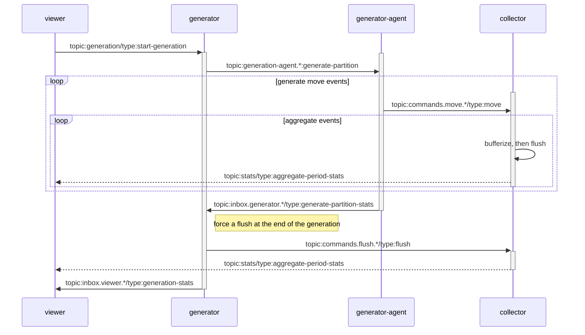
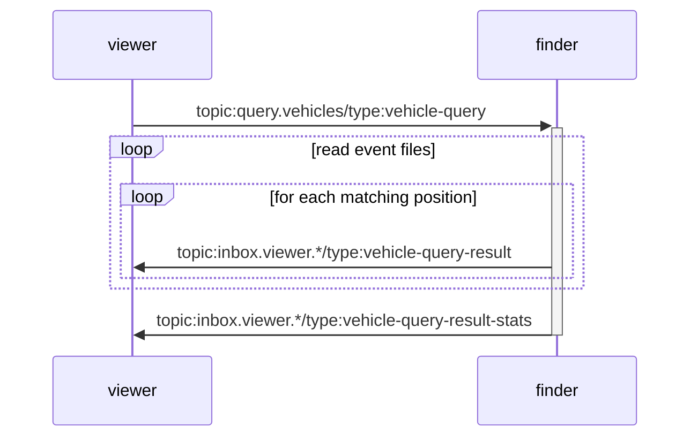
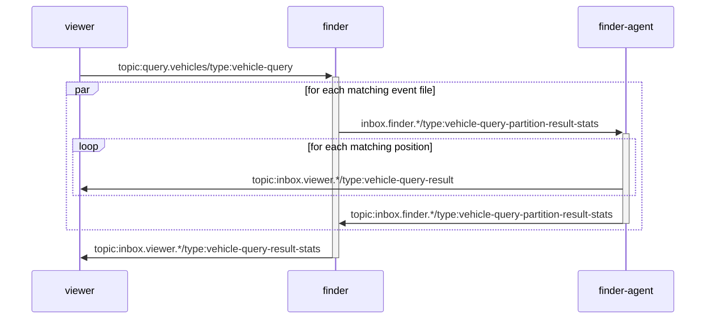

# Purpose

This is a sample project for exploring different ways of persisting Geospatial events for long term storage.

This is also an excuse to test various technologies to handle a massive amount of data.
This includes different programming languages, as well as cloud services.

# Functional requirements

- An organization would manage a fleet of vehicles that would report their current GPS position every 5 seconds.
- The vehicles would remain in the area of a specific city and would typically be assigned to a district of the city.
- The data should be archived for 7 years
- The data should be queryable in order to find which cars where moving in a specific period, within a specific area of the city.

# Estimates

Execute the `estimate.py` script to compute the estimates in the [event-estimator](./event-estimator/) folder.

# Architecture

## Messages

```
+-------------------------+-----------------+----------------------------+----------------+-----------------+------------------------------------------+
| Topic                   | Consumer Group  | Event Type                 | Produced by    | Consumed by     | Usage                                    |
+-------------------------+-----------------+----------------------------+----------------+-----------------+------------------------------------------+
| generation              | generators      | start-generation           | viewer         | generator       | The viewer will initiate a generation    |
+-------------------------+-----------------+----------------------------+----------------+-----------------+------------------------------------------+
| generation.agent.*      |generation-agents| generate-partition         | generator      | generator       | The generator will partition its work    |
|                         |                 |                            |                |                 | with its agents.                         |
+-------------------------+-----------------+----------------------------+----------------+-----------------+------------------------------------------+
| inbox.generator.*       | generators      | generate-partition-stats   | viewer         | generator       | The viewer will initiate a generation    |
+-------------------------+-----------------+----------------------------+----------------+-----------------+------------------------------------------+
| commands.move.*         |                 | move                       | generator      | collector       | The collector will agregate the move     |
|                         |                 |                            |                |                 | commands and persist them as a chunk.    |
|                         |                 |                            |                +-----------------+------------------------------------------+
|                         |                 |                            |                | viewer          | The viewer will display the move of      |
|                         |                 |                            |                |                 | each vehicle.                            |
+-------------------------+-----------------+----------------------------+----------------+-----------------+------------------------------------------+
| commands.flush.*        |                 | flush                      | generator      | collector       | At the end of the generation, a flush    |
|                         |                 |                            |                |                 | command is sent to force the collectors  |
|                         |                 |                            |                |                 | to write the accumulated data.           |
+-------------------------+-----------------+----------------------------+----------------+-----------------+------------------------------------------+
| stats                   |                 | aggregate-period-stats     | collector      | viewer          | Every time a chunk of data is persisted  |
|                         |                 |                            |                |                 | by the collector, some stats on the chunk|
|                         |                 |                            |                |                 | will be sent to the viewer.              |
+-------------------------+-----------------+----------------------------+----------------+-----------------+------------------------------------------+
| query.vehicles          | vehicle-finder  | vehicle-query              | viewer         | finder          | A client is querying the persisted data. |
|                         |                 |                            |                |                 | The finder will filter the chunks based  |
|                         |                 |                            |                |                 | on the time period and the geohashes of  |
|                         |                 |                            |                |                 | the polygon filter.                      |
+-------------------------+-----------------+----------------------------+----------------+-----------------+------------------------------------------+
|query.vehicles.partitions| vehicle-finder- | vehicle-query-partition    | finder         | finder          | The finder is delegating the file        |
|                         | partitions      |                            |                |                 | processing to the cluster of finders.    |
|                         |                 |                            |                |                 | The response will be sent using the      |
|                         |                 |                            |                |                 | vehicle-query-partition-result-stats evt |
+-------------------------+-----------------+----------------------------+----------------+-----------------+------------------------------------------+
| inbox.viewer.<UID>      |                 | vehicle-query-result       | finder         | viewer          | While parsing the chunks, the finder     |
|                         |                 |                            |                |                 | will send all the move commands that     |
|                         |                 |                            |                |                 | match the criteria. The viewer will then |
|                         |                 |                            |                |                 | be able to replay them.                  |
+-------------------------+-----------------+----------------------------+----------------+-----------------+------------------------------------------+
| inbox.viewer.<UID>      |                 | vehicle-query-result-stats | finder         | viewer          | Once the query is complete, the finder   |
|                         |                 |                            |                |                 | will send some stats to the viewer, to   |
|                         |                 |                            |                |                 | measure the performance and processing   |
|                         |                 |                            |                |                 | that was required.                       |
+-------------------------+-----------------+----------------------------+----------------+-----------------+------------------------------------------+
| inbox.finder.<UID>      |                 | vehicle-query-             | finder         | finder          | This is a partial result sent back to    |
|                         |                 | partition-result-stats     |                |                 | the finder that delegated the            |
|                         |                 |                            |                |                 | processing.                              |
+-------------------------+-----------------+----------------------------+----------------+-----------------+------------------------------------------+
```

Note that when a consumer uses a "consumer group" name, it means that the message will be handled only once by a member of the group.
This is a regular work queue with competing consumers, which is different from the default pub/sub case.

### Collecting move commands



### Querying move commands

#### Serialized processing



#### Parallel processing



## Local dev

### Features

- web UI for viewing realtime data or query results
- distributed services using a message broker
- durable storage of events
- distributed event generation with multiple instances for higher throughput
- multiple data formats (parquet, csv, json, arrow)
- multiple storage providers (filesystem, S3...)
- flexible aggregation of events

    - max window capacity
    - concurrent time windows
    - multiple data partitioning strategies (geohash, vehicle id...)

- flexible search

    - serialized or parallelized
    - record limit
    - timeout
    - ttl
    - time filters (time range)
    - geoloc filters (polygons) using GeoJSON
    - data filters (vehicle type)


### Diagram


```

                            +------------+
      Event Generator-------| Event Hub  |------Event Viewer
                            | (NATS)     |
                            +------------+
                              |      |
                        +-----+      +-----+
                        |                  |
                  Event collector       Event finder
                   |    |                  |
        +----------+  writes             reads
        |               |                  |
+-------------+      +-----------------------+
| Event Store |      | Event Aggregate Store |
| (In memory) |      | (File system or S3)   |
+-------------+      +-----------------------+

```

### Technologies:

- Event Hub: [NATS](https://nats.io/)
- Event Generator: Typescript NodeJS
- Event Viewer: Nuxt server, Typescript, PixiJS
- Event Collector: Typescript NodeJS, https://pola.rs/, Parquet format, S3, geohash
- Event Store: In memory, DuckDB
- Event finder: Typescript NodeJS, geohash, turf

## Cloud

### Azure

#### Diagram

```
                                           +-----> Event Viewer
                                           |         + NuxtJS
Event Generator ==> Event Hub -------------+         + PowerBI
                     + Azure Event Hubs    |
                                           +----> Event Collector -------> Event Aggregate Store <------ Event finder
                                                    + Azure Synapse            + Azure Blob                 + Azure Stream Analytics
```


#### Technologies:

- Event Hub: [Azure Event Hubs](https://azure.microsoft.com/fr-fr/products/event-hubs/)
- Event Generator: Typescript NodeJS
- Event Viewer: Nuxt server, Typescript, PixiJS
- Event Collector: [Azure Synapse Analytics](https://azure.microsoft.com/fr-fr/products/synapse-analytics/)
- Event Store: Azure Event Hubs
- Event finder: [Azure Stream Analytics](https://azure.microsoft.com/fr-fr/products/stream-analytics/)

### AWS

#### Diagram

```
                                           +-----> Event Viewer
                                           |         + NuxtJS
Event Generator ==> Event Hub -------------+         
                     + AWS Eventbridge     |
                                           +----> Event Collector -------> Event Aggregate Store <------ Event finder
                                                  + Amazon Data Firehose       + AWS S3                     + Amazon Athena
```


#### Technologies:

- Event Hub: [Amazon Eventbridge](https://aws.amazon.com/eventbridge/)
- Event Generator: Typescript NodeJS
- Event Viewer: Nuxt server, Typescript, PixiJS
- Event Collector: [Amazon Data firehose](https://aws.amazon.com/firehose/)
- Event Store: Amazon Eventbridge
- Event finder: [Azure Stream Analytics](https://azure.microsoft.com/fr-fr/products/stream-analytics/)

## File formats

- JSON
- CSV
- Arrow
- Parquet

# Roadmap

## Misc

create a script that would do the cost projections for the data that will be aggregated, stored and queried.

## Development

### NodeJS

#### Events

- use https://github.com/cloudevents/spec
- support auto reconnect when the server is not available
- Support multiple messaging systems such as RabbitMQ, AWS SQS or Azure Event Hubs
- Support event persistence
- Support retry in message handling

#### Generator


#### Collector

- use long term storage to persist events until they can be aggregated (instead of just using memory)
- implement consistent hashing for paritioning geohashes in the instances
- rewrite in Rust for speedup

#### Viewer

##### Web

- use a mapping widget to display the vehicles?
- try other Web frameworks?

##### Terminal

TODO: add a CLI that would listen to stats events and display aggregated stats.

### Python

TODO

### Rust

TODO

# Local development

Note that you can also use Docker for local development if you prefer. Then jump to the next "Deployment/Docker" section.

## Scripts

### Requirements

Python3 for running some scripts.

### install

`python3 -m venv .venv`
`.venv/bin/pip3 install -r scripts/requirements.txt`

## NodeJS

### Requirements

NodeJS LTS should be installed.

NATS server should be running. See [README](./event-hub/README.md) for the instructions.

### install

`bash scripts/nodejs/cleaup.sh`

`bash scripts/nodejs/install.sh`

### run the web viewer (optional)

You can use the dev mode with hotreload but it is much slower than the production build, when there are a lot of vehicles:

```shell
cd ./event/viewer/web/nuxt
open http://localhost:3000/
npm run dev
```

Or you can build a production release and run it (this is much more performant):
```shell
cd ./event/viewer/web/nuxt
npm npm run build
open http://localhost:3000/
npm run preview
```

### generate events

`.venv/bin/python3 scripts/nodejs/start.py`

# Deployment

## Requirements

- docker
- docker-compose
- kubectl
- nodejs

## Docker 

### build

`bash scripts/nodejs/docker-build.sh`

### run

The following script will start a `docker-compose`. Note that we run a single instance of each component in this mode.

`bash scripts/nodejs/docker-run.sh`

## Kubernetes

cd deployment/kubernetes
```shell
npm i
npm run synth
```

Select the right Kubernetes cluster (either with the KUBECONFIG env var, or with a kubectl context).

```shell
kubectl apply -f dist/*
```

Wait for everything to be created.

Browse to http://vehicle-fleet-viewer.kube.lab.ile.montreal.qc.ca/

If you want to cleanup the kubernetes resources:
```shell
kubectl delete -f dist/0001-vehicles.k8s.yaml
kubectl delete -f dist/0000-vehicles-ns.k8s.yaml
```

# References

https://medium.com/@igorvgorbenko/geospatial- data-analysis-in-clickhouse-polygons-geohashes-and-h3-indexing-2f55ff100fbe#:~:text=H3%20Indexing,-H3%20indexing&text=Similar%20to%20geohashes%2C%20a%20longer,occupy%20a%20fixed%208%20bytes.

https://medium.com/data-engineering-chariot/aggregating-files-in-your-data-lake-part-1-ed115b95425c
https://docs.aws.amazon.com/firehose/latest/dev/dynamic-partitioning.html
https://deepak6446.medium.com/why-did-we-move-from-mongodb-to-athena-with-parquet-297b61ddf299

https://learn.microsoft.com/en-us/azure/stream-analytics/stream-analytics-real-time-fraud-detection
https://www.red-gate.com/simple-talk/cloud/azure/query-blob-storage-sql-using-azure-synapse/

https://hivekit.io/blog/how-weve-saved-98-percent-in-cloud-costs-by-writing-our-own-database/
